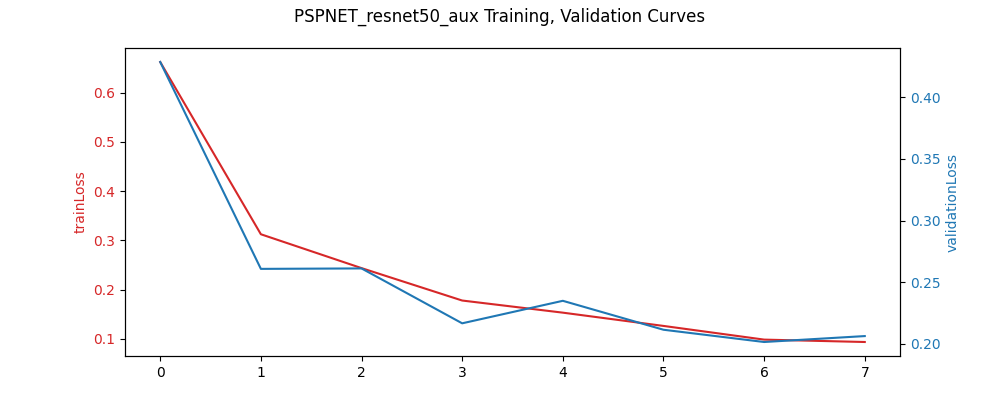
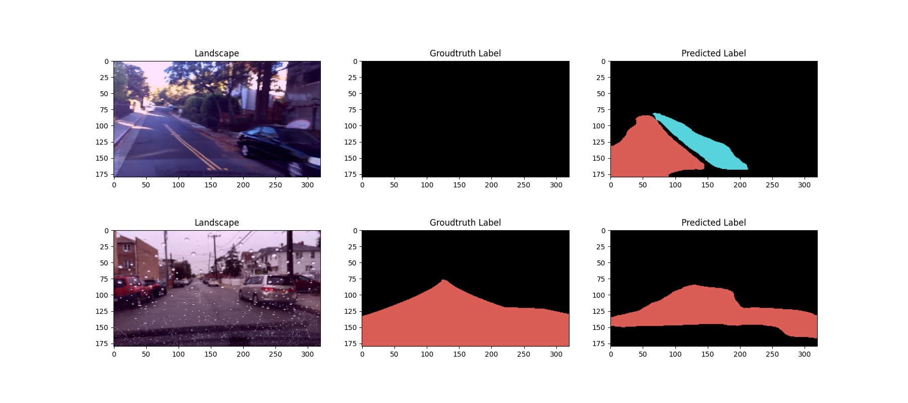
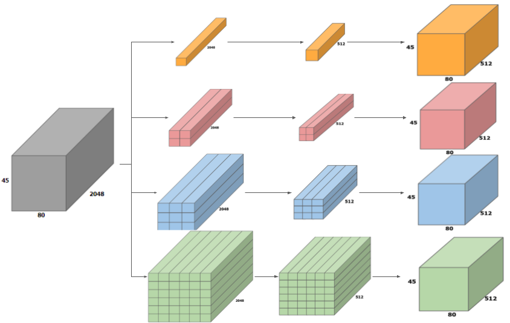

### PSPNet

Tutorial on building a PSPNet model for semantic segmentation using pytorch framework

The model was trained for 8 epochs and achieved 0.77 mean IOU:

Example of visualization:

### Pyramid Pooling Module notes

- Pyramid Pooling Module helps to capture Features at Multiple scales

- It takes as input Feature map from the Backbone

- Condenses information spatially to fixed 2D output

- **Output from PPM with different scales are concatenated to provide multi-scale feature pyramid**

- **Skip-connecting the original feature map provides a rich global contextual prior**

### Auxiliary Branch

Separate auxiliary branch using Layer3 output of Resnet backbones

Auxiliary branch helps to set initial values for residual blocks

Auxiliary branch used only during training and not inference

Auxiliary branch uses similar classifier and loss function of main branch

Alpha is a hyper parameter with a value of 0.4

### Additional References

[PSPNet example from kaggle](https://www.kaggle.com/code/balraj98/pyramid-scene-parsing-pspnet-resnext50-pytorch)

( above example uses the prebuilt smp module's PSPNet model ... )